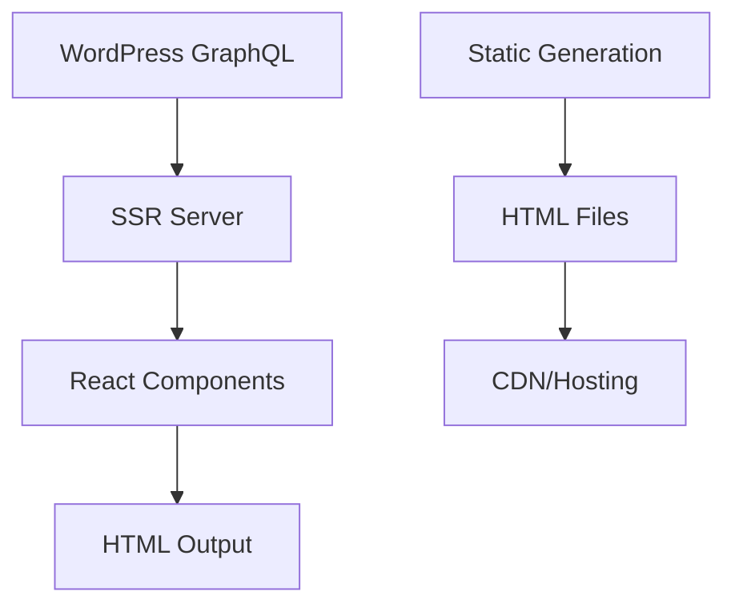

# SSR-Starter

[](https://github.com/your-org/ssr-starter)
[](LICENSE)

A modern SSR (Server-Side Rendering) application built with Bun, Elysia.js, React, and WordPress GraphQL integration. Includes static HTML generation capabilities.

## 🚀 Quick Start

Get up and running in 5 minutes:

```bash
# Install Bun
curl -fsSL https://bun.sh/install | bash

# Clone and setup
git clone https://github.com/your-org/ssr-starter.git
cd ssr-starter
bun install

# Configure environment
cp env.example .env
# Edit .env with your WordPress GraphQL endpoint

# Run development server
bun run dev

# Visit http://localhost:3000
```

## 📚 Documentation

### [Getting Started](docs/getting-started/introduction.md)
- [Introduction](docs/getting-started/introduction.md) - Framework overview
- [Quick Start](docs/getting-started/quick-start.md) - 5-minute setup guide
- [Installation](docs/getting-started/installation.md) - Setup instructions
- [Project Structure](docs/getting-started/project-structure.md) - Codebase organization

### [Guides](docs/guides/ssr-architecture.md)
- [SSR Architecture](docs/guides/ssr-architecture.md) - Rendering pipeline
- [Data Flow](docs/guides/data-flow.md) - How data flows through the app
- [Static Generation](docs/guides/static-generation.md) - HTML generation
- [Adding Pages](docs/guides/adding-pages.md) - Create new routes

### [API Reference](docs/api/server-api.md)
- [Server API](docs/api/server-api.md) - HTTP endpoints
- [Component Library](docs/api/component-library.md) - UI components

### [Configuration](docs/configuration/environment-variables.md)
- [Environment Variables](docs/configuration/environment-variables.md) - Configuration options

### [Deployment](docs/deployment/docker.md)
- [Docker Deployment](docs/deployment/docker.md) - Container deployment
- [Railway/Nixpacks](docs/deployment/railway.md) - One-click deployment
- [Vercel/Netlify](docs/deployment/vercel-netlify.md) - Static hosting

### [Troubleshooting](docs/troubleshooting/common-issues.md)
- [Common Issues](docs/troubleshooting/common-issues.md) - Solutions to problems

## 🎯 Key Features

### ⚡ Performance
- **Server-Side Rendering**: SEO-optimized initial loads
- **Static HTML Generation**: Generate static versions of pages
- **Fast Rendering**: Optimized React rendering pipeline

### 🔧 Simplicity
- **WordPress Integration**: Seamless GraphQL API integration
- **TypeScript**: Full type safety throughout
- **Modern Stack**: Bun runtime, Elysia.js server, React components

### 🛠 Developer Experience
- **Hot Reload**: Instant development feedback
- **Clean Architecture**: Simple and maintainable codebase
- **Easy Deployment**: Docker and cloud platform support

### 📦 Production Ready
- **Docker Support**: Containerized deployment
- **Multi-Platform**: Railway, Vercel, Netlify, custom servers
- **Health Monitoring**: Built-in health checks

## 🏗 Architecture



## 📋 Requirements

- **Runtime**: Bun 1.0+
- **Memory**: 512MB minimum, 1GB recommended
- **Storage**: 500MB for dependencies

## 🌟 Use Cases

- **Blog Platforms**: High-performance WordPress-powered blogs
- **Content Management**: CMS-driven websites with SEO requirements
- **Documentation Sites**: Static generation for developer docs
- **Corporate Websites**: Business websites with dynamic content
- **Marketing Sites**: Fast-loading landing pages

## 📄 License

This project is licensed under the MIT License - see the [LICENSE](../LICENSE.md) file for details.

## 🆘 Support

- **Documentation**: You're reading it! 🎉
- **Issues**: [GitHub Issues](https://github.com/your-org/ssr-starter/issues)

## 📈 Roadmap

### Current Version (1.0.x)
- ✅ SSR with React
- ✅ Static HTML generation
- ✅ WordPress GraphQL integration
- ✅ Docker deployment
- ✅ Clean documentation

### Upcoming Features
- 🔄 Enhanced static generation options
- 🔄 Additional WordPress integration features
- 🔄 Performance optimizations

---