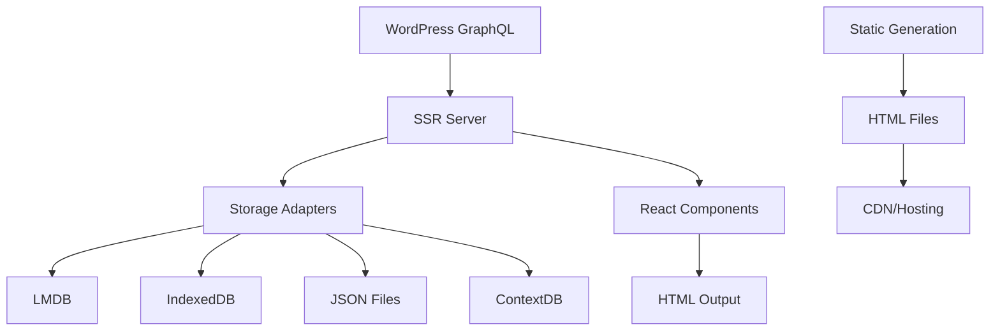

# SSR-Starter Documentation

[](https://your-org.gitbook.io/ssr-starter)
[](https://github.com/your-org/ssr-starter)
[](LICENSE)

Welcome to the comprehensive documentation for **SSR-Starter**, a modern SSR (Server-Side Rendering) and SSG (Static Site Generation) framework built with Bun, Elysia.js, React, and WordPress GraphQL integration.

## 🚀 Quick Start

Get up and running in 5 minutes:

```bash
# Install Bun
curl -fsSL https://bun.sh/install | bash

# Clone and setup
git clone https://github.com/your-org/ssr-starter.git
cd ssr-starter
bun install

# Configure environment
cp env.example .env
# Edit .env with your WordPress GraphQL endpoint

# Build and run
bun run build
bun run dev

# Visit http://localhost:3000
```

## 📚 Documentation Overview

This documentation is organized into the following sections:

### [Getting Started](getting-started/introduction.md)
- [Introduction](getting-started/introduction.md) - Framework overview and features
- [Quick Start](getting-started/quick-start.md) - 5-minute setup guide
- [Installation](getting-started/installation.md) - Detailed installation instructions
- [Project Structure](getting-started/project-structure.md) - Codebase organization

### [Guides](guides/offline-cms-101.md)
- [Offline CMS Development 101](guides/offline-cms-101.md) - Complete beginner's guide to offline apps
- [SSR Architecture](guides/ssr-architecture.md) - Deep dive into rendering pipeline
- [Data Flow](guides/data-flow.md) - How data moves through the system
- [Storage Adapters](guides/storage-adapters.md) - Database and caching options
- [Static Generation](guides/static-generation.md) - SSG workflow and optimization
- [Theming & Styling](guides/theming-styling.md) - UI customization guide
- [Adding Pages](guides/adding-pages.md) - Create new routes and components
- [Working with Data](guides/working-with-data.md) - Data fetching and manipulation
- [Offline Mode](guides/offline-mode.md) - Progressive Web App features

### [API Reference](api/server-api.md)
- [Server API](api/server-api.md) - HTTP endpoints and responses
- [Client API](api/client-api.md) - Browser-side JavaScript API
- [Storage Adapters](api/storage-adapters.md) - Storage interface specifications
- [GraphQL Integration](api/graphql-integration.md) - WordPress API integration
- [Component Library](api/component-library.md) - UI components reference

### [Configuration](configuration/environment-variables.md)
- [Environment Variables](configuration/environment-variables.md) - All configuration options
- [WordPress Setup](configuration/wordpress-setup.md) - CMS configuration guide
- [Build Configuration](configuration/build-config.md) - Build pipeline customization
- [Docker Configuration](configuration/docker-config.md) - Container setup

### [Deployment](deployment/docker.md)
- [Docker Deployment](deployment/docker.md) - Container deployment guide
- [Railway/Nixpacks](deployment/railway.md) - One-click cloud deployment
- [Vercel/Netlify](deployment/vercel-netlify.md) - Static hosting platforms
- [Production Checklist](deployment/production-checklist.md) - Go-live preparation

### [Contributing](contributing/development-workflow.md)
- [Development Workflow](contributing/development-workflow.md) - Contributing guidelines
- [Testing Guide](contributing/testing-guide.md) - Testing strategies and tools
- [Adding Features](contributing/adding-features.md) - Feature development process
- [Code Style](contributing/code-style.md) - Code formatting and standards

### [Troubleshooting](troubleshooting/common-issues.md)
- [Common Issues](troubleshooting/common-issues.md) - Solutions to frequent problems
- [Debugging](troubleshooting/debugging.md) - Debug tools and techniques
- [Performance](troubleshooting/performance.md) - Optimization strategies
- [FAQ](troubleshooting/faq.md) - Frequently asked questions

## 🎯 Key Features

### ⚡ Performance
- **Server-Side Rendering**: SEO-optimized initial loads
- **Static Site Generation**: CDN-ready static files
- **Intelligent Caching**: Multi-level caching system
- **Route-Based Optimization**: Minimal data per page

### 🔧 Flexibility
- **Multiple Storage Adapters**: LMDB, IndexedDB, JSON, ContextDB
- **Offline Mode**: Full functionality without network
- **WordPress Integration**: Seamless headless CMS integration
- **Progressive Enhancement**: Works without JavaScript

### 🛠 Developer Experience
- **TypeScript**: Full type safety throughout
- **Hot Reload**: Instant development feedback
- **Modern Stack**: Bun runtime, Elysia.js server, React components
- **Comprehensive Testing**: Unit, integration, and E2E tests

### 📦 Production Ready
- **Docker Support**: Containerized deployment
- **Multi-Platform**: Railway, Vercel, Netlify, custom servers
- **Monitoring**: Health checks and metrics
- **Security**: Built-in security headers and validation

## 🏗 Architecture



## 📋 Requirements

- **Runtime**: Bun 1.0+ or Node.js 18+
- **WordPress**: 5.0+ with WPGraphQL plugin
- **Memory**: 512MB minimum, 2GB recommended
- **Storage**: 500MB for dependencies, 1GB+ for data

## 🌟 Use Cases

- **Blog Platforms**: High-performance WordPress-powered blogs
- **Content Management**: CMS-driven websites with SEO requirements
- **E-commerce**: Product catalogs with server-side rendering
- **Documentation Sites**: Static generation for developer docs
- **Progressive Web Apps**: Offline-capable web applications
- **Marketing Sites**: Fast-loading landing pages

## 🤝 Contributing

We welcome contributions! Please see our [Contributing Guide](contributing/development-workflow.md) for details on:

- Setting up a development environment
- Coding standards and practices
- Testing requirements
- Pull request process

## 📄 License

This project is licensed under the MIT License - see the [LICENSE](../LICENSE.md) file for details.

## 🆘 Support

- **Documentation**: You're reading it! 🎉
- **Issues**: [GitHub Issues](https://github.com/your-org/ssr-starter/issues)
- **Discussions**: [GitHub Discussions](https://github.com/your-org/ssr-starter/discussions)
- **Discord**: Join our community server
- **Commercial Support**: [Book a consultation](https://calendly.com/your-org)

## 📈 Roadmap

### Current Version (1.0.x)
- ✅ SSR with React
- ✅ Multiple storage adapters
- ✅ Static site generation
- ✅ WordPress GraphQL integration
- ✅ Docker deployment
- ✅ Comprehensive documentation

### Upcoming Features
- 🔄 Redis adapter support
- 🔄 Advanced caching strategies
- 🔄 Real-time data synchronization
- 🔄 Multi-language support (i18n)
- 🔄 Advanced analytics integration
- 🔄 Plugin system for extensions

---

**Ready to build something amazing?** Let's get started with the [Quick Start Guide](getting-started/quick-start.md)! 🚀