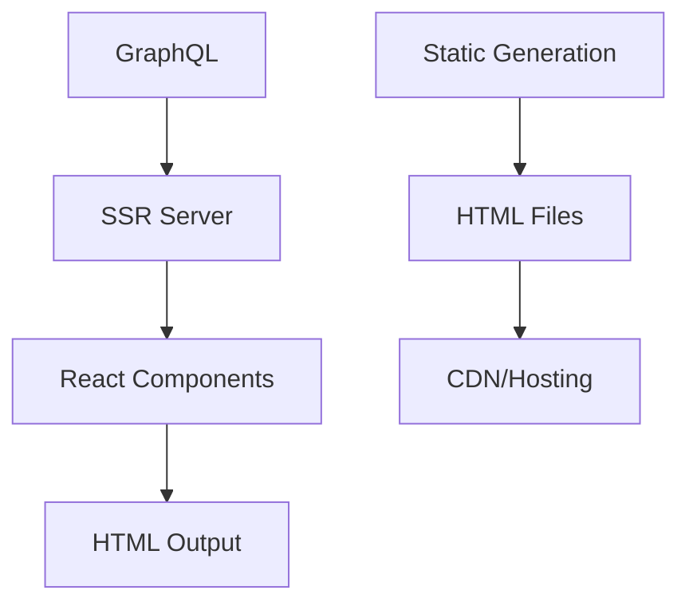

# SSR-Starter Documentation

[](https://docs.buildy.tw/)
[](https://github.com/buildy-ui/ssr-starter)
[](LICENSE)

Welcome to the documentation for **SSR-Starter**, a modern SSR (Server-Side Rendering) application built with Bun, Elysia.js, and React, with support for generating static HTML versions of pages.

## 🚀 Quick Start

Get up and running in 5 minutes:

```bash
# Install Bun
curl -fsSL https://bun.sh/install | bash

# Clone and setup
git clone https://github.com/buildy-ui/ssr-starter.git
cd ssr-starter
bun install

# Configure environment
cp env.example .env
# Edit .env with your GraphQL endpoint

# Build and run
bun run build
bun run dev

# Visit http://localhost:3000
```

## 📚 Documentation Overview

This documentation is organized into the following sections:

### [Getting Started](getting-started/introduction.md)
- [Introduction](getting-started/introduction.md) - Framework overview and features
- [Quick Start](getting-started/quick-start.md) - 5-minute setup guide
- [Installation](getting-started/installation.md) - Detailed installation instructions
- [Project Structure](getting-started/project-structure.md) - Codebase organization

### [Guides](guides/ssr-architecture.md)
- [SSR Architecture](guides/ssr-architecture.md) - Deep dive into rendering pipeline
- [Data Flow](guides/data-flow.md) - How data moves through the application
- [Static Generation](guides/static-generation.md) - HTML generation workflow
- [Adding Pages](guides/adding-pages.md) - Create new routes and components

### [API Reference](api/server-api.md)
- [Server API](api/server-api.md) - HTTP endpoints and responses
- [Component Library](api/component-library.md) - UI components reference

### [Configuration](configuration/environment-variables.md)
- [Environment Variables](configuration/environment-variables.md) - Configuration options

### [Deployment](deployment/docker.md)
- [Docker Deployment](deployment/docker.md) - Container deployment guide
- [Railway/Nixpacks](deployment/railway.md) - One-click cloud deployment
- [Vercel/Netlify](deployment/vercel-netlify.md) - Static hosting platforms
- [Production Checklist](deployment/production-checklist.md) - Go-live preparation

### [Troubleshooting](troubleshooting/common-issues.md)
- [Common Issues](troubleshooting/common-issues.md) - Solutions to frequent problems
- [Debugging](troubleshooting/debugging.md) - Debug tools and techniques
- [Performance](troubleshooting/performance.md) - Optimization strategies

## 🎯 Key Features

### ⚡ Performance
- **Server-Side Rendering**: SEO-optimized initial loads
- **Static HTML Generation**: Generate static versions of pages
- **Fast Rendering**: Optimized React rendering pipeline

### 🔧 Simplicity
- **GraphQL Integration**: Seamless headless CMS integration
- **TypeScript**: Full type safety throughout
- **Modern Stack**: Bun runtime, Elysia.js server, React components

### 🛠 Developer Experience
- **Hot Reload**: Instant development feedback
- **Clean Architecture**: Simple and maintainable codebase
- **Easy Deployment**: Docker and cloud platform support

### 📦 Production Ready
- **Docker Support**: Containerized deployment
- **Multi-Platform**: Railway, Vercel, Netlify, custom servers
- **Health Monitoring**: Built-in health checks

## 🏗 Architecture



## 📋 Requirements

- **Runtime**: Bun 1.0+
- **Memory**: 512MB minimum, 1GB recommended
- **Storage**: 500MB for dependencies

## 🌟 Use Cases

- **Blog Platforms**: High-performance GraphQL-powered blogs
- **Content Management**: CMS-driven websites with SEO requirements
- **Documentation Sites**: Static generation for developer docs
- **Marketing Sites**: Fast-loading landing pages
- **Corporate Websites**: Business websites with dynamic content

## 🤝 Contributing

We welcome contributions! Please see our [Contributing Guide](contributing/development-workflow.md) for details on:

- Setting up a development environment
- Coding standards and practices
- Testing requirements
- Pull request process

## 📄 License

This project is licensed under the MIT License - see the [LICENSE](../LICENSE.md) file for details.

## 🆘 Support

- **Documentation**: You're reading it! 🎉
- **Issues**: [GitHub Issues](https://github.com/buildy-ui/ssr-starter/issues)
- **Discord**: Join our community server - later
- **Commercial Support**: [Book a consultation](https://calendly.com/your-org) - later

## 📈 Roadmap

### Current Version (1.0.x)
- ✅ SSR with React
- ✅ Static HTML generation
- ✅ GraphQL integration
- ✅ Docker deployment
- ✅ Clean documentation

### Upcoming Features
- 🔄 Enhanced static generation options
- 🔄 Additional GraphQL integration features
- 🔄 Performance optimizations

---

**Ready to build something amazing?** Let's get started with the [Quick Start Guide](getting-started/quick-start.md)! 🚀