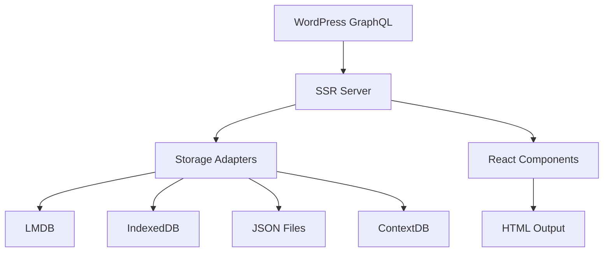

# Introduction

Welcome to **SSR-Starter**, a modern SSR (Server-Side Rendering) and SSG (Static Site Generation) framework built with Bun, Elysia.js, React, and WordPress GraphQL integration.

## What is SSR-Starter?

SSR-Starter is a production-ready framework for building fast, SEO-friendly websites and applications. It combines the power of server-side rendering with flexible data storage adapters and offline capabilities.

## Key Features

### 🚀 Performance
- **Server-Side Rendering**: Fast initial page loads with SEO optimization
- **Static Site Generation**: CDN-ready static files for maximum performance
- **Intelligent Caching**: Multiple storage adapters for optimal data access

### 🔧 Flexibility
- **Multiple Storage Adapters**: LMDB, IndexedDB, JSON, and ContextDB support
- **Offline Mode**: Full functionality without internet connection
- **WordPress Integration**: Seamless GraphQL API integration

### 🛠 Developer Experience
- **TypeScript**: Full type safety throughout the application
- **Hot Reload**: Fast development with instant feedback
- **Modern Stack**: Bun runtime, Elysia.js server, React components

### 📦 Production Ready
- **Docker Support**: Containerized deployment
- **Railway/Nixpacks**: One-click deployment
- **Vercel/Netlify**: Static site hosting

## Architecture Overview



## Use Cases

- **Blog Platforms**: High-performance WordPress-powered blogs
- **Content Management**: CMS-driven websites with SEO requirements
- **E-commerce**: Product catalogs with server-side rendering
- **Documentation Sites**: Static generation for developer docs
- **Progressive Web Apps**: Offline-capable web applications

## Technology Stack

| Component | Technology | Purpose |
|-----------|------------|---------|
| Runtime | Bun | Fast JavaScript runtime |
| Server | Elysia.js | HTTP server with TypeScript |
| Frontend | React | Component library |
| Styling | TailwindCSS | Utility-first CSS framework |
| Database | LMDB | High-performance key-value store |
| API | WordPress GraphQL | Content management |
| Build | Bun Build | Asset bundling |
| Deployment | Docker | Containerization |

## Quick Example

```typescript
// Server setup
const app = new Elysia()
  .get('*', async ({ request }) => {
    const context = await getRenderContext(request.url);
    const html = renderToString(<App context={context} />);
    return renderTemplate({ html, context });
  });

// Storage configuration
const storage = createStorageAdapter({
  main: 'LMDB',
  backup: 'IndexedDB'
});

// Data synchronization
await syncFromGraphQL(GRAPHQL_ENDPOINT);
```

## Next Steps

- [Quick Start Guide](quick-start.md) - Get up and running in 5 minutes
- [Installation](installation.md) - Detailed setup instructions
- [Project Structure](project-structure.md) - Understand the codebase
