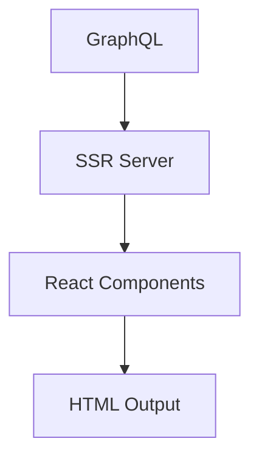

# Introduction

Welcome to **SSR-Starter**, a modern SSR (Server-Side Rendering) application built with Bun, Elysia.js, React, and GraphQL integration.

## What is SSR-Starter?

SSR-Starter is a production-ready framework for building fast, SEO-friendly websites. It combines server-side rendering with clean data handling and static HTML generation.

## Key Features

### 🚀 Performance
- **Server-Side Rendering**: Fast initial page loads with SEO optimization
- **Static HTML Generation**: Generate static versions of pages
- **Clean Architecture**: Simple and efficient data flow

### 🔧 Simplicity
- **GraphQL Integration**: Seamless GraphQL API integration
- **TypeScript**: Full type safety throughout the application
- **Modern Stack**: Bun runtime, Elysia.js server, React components

### 🛠 Developer Experience
- **Hot Reload**: Fast development with instant feedback
- **Easy Deployment**: Docker and cloud platform support

### 📦 Production Ready
- **Docker Support**: Containerized deployment
- **Railway/Nixpacks**: One-click deployment
- **Vercel/Netlify**: Static site hosting

## Architecture Overview



## Use Cases

- **Blog Platforms**: High-performance GraphQL-powered blogs
- **Content Management**: CMS-driven websites with SEO requirements
- **Documentation Sites**: Static generation for developer docs
- **Corporate Websites**: Business websites with dynamic content

## Technology Stack

| Component | Technology | Purpose |
|-----------|------------|---------|
| Runtime | Bun | Fast JavaScript runtime |
| Server | Elysia.js | HTTP server with TypeScript |
| Frontend | React | Component library |
| Styling | TailwindCSS | Utility-first CSS framework |
| API | GraphQL | Content management |
| Build | Bun Build | Asset bundling |
| Deployment | Docker | Containerization |

## Quick Example

```typescript
// Server setup
const app = new Elysia()
  .get('*', async ({ request }) => {
    const context = await getRenderContext(request.url);
    const html = renderToString(<App context={context} />);
    return renderTemplate({ html, context });
  });

// Data fetching
await syncAllData();
```

## Next Steps

- [Quick Start Guide](quick-start.md) - Get up and running in 5 minutes
- [Installation](installation.md) - Detailed setup instructions
- [Project Structure](project-structure.md) - Understand the codebase
