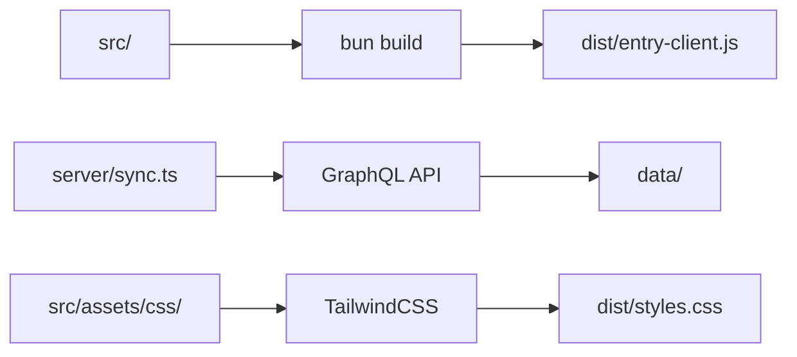

# Project Structure

Comprehensive overview of SSR-Starter's file organization and architecture.

## Root Directory Structure

```
ssr-starter/
├── src/                    # Client-side source code
├── server/                 # Server-side code
├── scripts/                # Build and utility scripts
├── docs/                   # Documentation
├── data/                   # Data storage (LMDB/JSON)
├── dist/                   # Built assets
├── types/                  # TypeScript declarations
├── docs/                   # Documentation
├── *.config.*             # Configuration files
└── package.json           # Dependencies and scripts
```

## Source Directory (`src/`)

### Components (`src/components/`)

React components organized by functionality:

```
src/components/
├── ui/                    # Base UI components (Button, Card, etc.)
│   ├── Button.tsx
│   ├── Card.tsx
│   ├── Container.tsx
│   └── ...
├── cards/                 # Content cards
│   ├── PostCard.tsx
│   ├── AuthorCard.tsx
│   └── CategoryCard.tsx
├── Accordion.tsx          # Complex components
├── Breadcrumbs.tsx
├── HtmlContent.tsx
├── PostMeta.tsx
├── SearchBar.tsx
├── SEO.tsx
└── ui8kit.ts            # Component library exports
```

### Routes (`src/routes/`)

Page components for routing:

```
src/routes/
├── Home.tsx              # Homepage
├── Blog.tsx              # Blog listing with pagination
├── Post.tsx              # Individual post page
├── Category.tsx          # Category archive
├── Tag.tsx               # Tag archive
├── Author.tsx            # Author archive
├── Search.tsx            # Search results
├── About.tsx             # Static pages
└── Test.tsx             # Testing/development page
```

### Data Layer (`src/data/`)

Data management and API integration:

```
src/data/
├── index.ts              # Main data exports
├── context.ts            # React context providers
├── types.ts              # TypeScript type definitions
├── graphql/              # GraphQL API client
│   └── index.ts
└── wpfasty/              # WPFasty integration (legacy)
    ├── context.ts
    └── types.ts
```

### Assets (`src/assets/`)

Static assets and styles:

```
src/assets/
├── css/
│   └── index.css         # TailwindCSS entry point
└── font/                 # Font files
    ├── Nunito/
    └── NunitoSans/
```

### Providers (`src/providers/`)

React context providers:

```
src/providers/
├── render-context.tsx    # SSR data context
└── theme.tsx            # Theme configuration
```

### Utilities (`src/lib/`)

Helper functions and utilities:

```
src/lib/
├── paths.ts              # Path utilities
├── twsx.ts               # TailwindCSS utilities
└── utils.ts              # General utilities
```

## Server Directory (`server/`)

### Core Server Files

```
server/
├── index.ts              # Main Elysia.js server
├── render.tsx            # React SSR rendering
├── template.ts           # HTML template generation
├── sync.ts               # Data synchronization
└── db.ts                 # Legacy LMDB operations
```

### Storage Adapters (`server/storage/`)

Pluggable storage system:

```
server/storage/
├── index.ts              # Storage factory
├── types.ts              # Storage interfaces
├── adapter.lmdb.ts       # LMDB adapter
└── adapter.json.ts       # JSON file adapter
```

## Scripts Directory (`scripts/`)

Build and utility scripts:

```
scripts/
├── generate.ts           # Static site generation runner
└── routeToStatic.ts      # SSG implementation
```

## Configuration Files

### Build Configuration

```json
// package.json - Dependencies and scripts
{
  "scripts": {
    "dev": "bun run build && bun --watch server/index.ts",
    "build": "bun run tailwind:build && bun run client:build",
    "start": "NODE_ENV=production bun run server/index.ts"
  }
}

// tsconfig.json - TypeScript configuration
{
  "compilerOptions": {
    "target": "ES2022",
    "module": "ESNext",
    "jsx": "react-jsx"
  }
}
```

### Runtime Configuration

```typescript
// bunfig.toml - Bun runtime configuration
[install]
cache = true

// env.example - Environment variables template
GRAPHQL_ENDPOINT=https://your-site.com/graphql
S3_ASSETS_URL=https://your-assets.com
MAINDB=LMDB
BACKUPDB=IndexedDB
```

## Data Directory (`data/`)

Runtime data storage:

```
data/
├── db/                   # LMDB database files
│   ├── data.mdb
│   └── lock.mdb
└── json/                 # JSON data files (IndexedDB alternative)
    └── full.json
```

## Build Output (`dist/`)

Compiled assets:

```
dist/
├── entry-client.js       # Hydrated React bundle
├── entry-client.js.map   # Source map
└── styles.css           # Compiled TailwindCSS
```

## Documentation (`docs/`)

```
docs/
├── SUMMARY.md            # GitBook navigation
├── getting-started/
├── guides/
├── api/
├── configuration/
├── deployment/
├── contributing/
├── troubleshooting/
└── assets/              # Images and diagrams
```

## Key Architecture Patterns

### 1. Component Organization

- **UI Components**: Reusable, themeable components in `ui/`
- **Content Components**: Blog-specific components in root
- **Card Components**: Specialized display components in `cards/`

### 2. Data Flow

```
GraphQL → Storage Adapter → Render Context → React Components → HTML
```

### 3. Storage Abstraction

```typescript
// Pluggable storage system
interface StorageAdapter {
  save(collections: DataCollections): Promise<void>
  load(): Promise<DataCollections | null>
  clear(): Promise<void>
}
```

### 4. Route-Based Rendering

```typescript
// Per-route context optimization
getRouteContext(path: string): RenderContext {
  // Return minimal data for specific routes
  switch (path) {
    case '/': return getHomeContext()
    case '/blog': return getBlogContext()
    default: return getFullContext()
  }
}
```

## File Naming Conventions

- **Components**: `PascalCase.tsx` (e.g., `PostCard.tsx`)
- **Utilities**: `kebab-case.ts` (e.g., `utils.ts`)
- **Types**: `PascalCase.ts` (e.g., `RenderContext.ts`)
- **Configuration**: `camelCase.config.js` or `kebab-case.config.js`

## Development Workflow

1. **Client Changes**: `src/` → `dist/entry-client.js`
2. **Server Changes**: `server/` → Hot reload
3. **Styles**: `src/assets/css/` → `dist/styles.css`
4. **Data**: GraphQL → `data/` via adapters
5. **Static Generation**: `scripts/` → `www/html/`

## Build Pipeline



This structure provides clear separation of concerns, making the codebase maintainable and extensible for future development.
