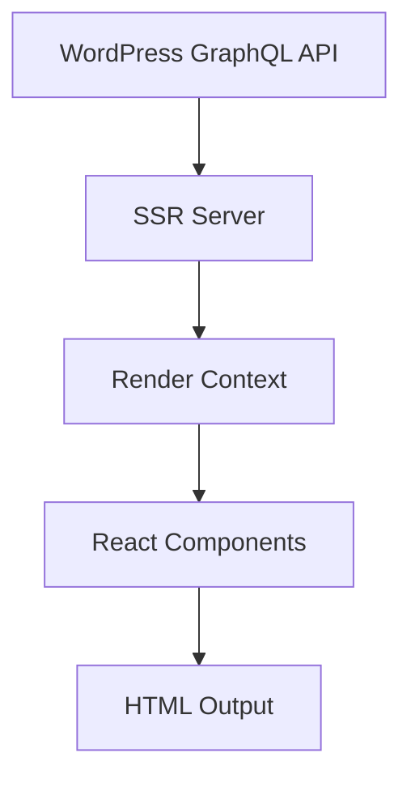

# Data Flow

Guide to how data flows through the SSR application.

## Overview

The application follows a simple data flow: fetch data from WordPress GraphQL API and render it server-side.



## Data Sources

### Primary Data Source: WordPress GraphQL

**Endpoint**: `GRAPHQL_ENDPOINT` environment variable

**Data Types**:
- Posts (with content, metadata, featured images)
- Pages (static content)
- Categories and Tags (taxonomy)
- Authors (user data)
- Site settings (title, description, menus)

## Data Fetching

### Initial Data Load

The application fetches data from WordPress GraphQL API on server startup:

```typescript
// server/sync.ts
export async function syncAllData() {
  // Fetch from WordPress GraphQL endpoints
  const [posts, categories, tags, authors, pages] = await Promise.all([
    getPosts(),
    getCategories(),
    getTags(),
    getAuthors(),
    getPages()
  ]);

  // Transform and store data for rendering
  const transformedData = {
    posts: posts.posts.map(transformPost),
    categories,
    tags,
    authors,
    pages: pages.map(transformPage)
  };

  return transformedData;
}
```

## Rendering Process

### Context Creation

Data is organized into a render context for each page:

```typescript
interface RenderContext {
  posts: { posts: PostData[] };
  categories: CategoryData[];
  tags: TagData[];
  authors: AuthorData[];
  pages: PageSummary[];
  site: SiteConfig;
}

export async function getRenderContext(): Promise<RenderContext> {
  const data = await syncAllData();

  return {
    posts: { posts: data.posts },
    categories: data.categories,
    tags: data.tags,
    authors: data.authors,
    pages: data.pages,
    site: data.site
  };
}
```

### Server-Side Rendering

The server renders React components with the data context:

```typescript
// server/index.ts
app.get('*', async ({ request }) => {
  const context = await getRenderContext(request.url);
  const html = renderToString(<App context={context} />);
  return renderTemplate({ html, context });
});
```