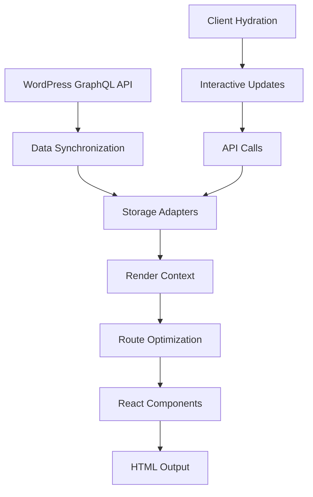

# Data Flow

Comprehensive guide to how data flows through SSR-Starter's architecture.

## Overview

SSR-Starter implements a sophisticated data flow that ensures optimal performance while maintaining data freshness and offline capabilities.



## Data Sources

### Primary Data Source: WordPress GraphQL

**Endpoint**: `GRAPHQL_ENDPOINT` environment variable

**Data Types**:
- Posts (with content, metadata, featured images)
- Pages (static content)
- Categories and Tags (taxonomy)
- Authors (user data)
- Site settings (title, description, menus)

### Secondary Data Sources

**API Endpoints**:
- `/api/posts` - Paginated post listing
- `/health` - System status and metrics

**Client-Side Data**:
- Browser storage (IndexedDB, LocalStorage)
- Service Worker cache
- HTTP cache headers

## Synchronization Process

### Initial Data Load

```typescript
// server/sync.ts
export async function syncAllData() {
  // 1. Fetch from all GraphQL endpoints
  const [posts, categories, tags, authors, pages] = await Promise.all([
    getPosts(),
    getCategories(),
    getTags(),
    getAuthors(),
    getPages()
  ]);

  // 2. Transform data structures
  const transformedPosts = posts.posts.map(transformPost);
  const transformedPages = pages.map(transformPage);

  // 3. Save to primary storage
  await primaryAdapter.save({
    posts: transformedPosts,
    categories,
    tags,
    authors,
    pages: transformedPages
  });

  // 4. Backup to secondary storage (if configured)
  if (backupAdapter) {
    await backupAdapter.save(data);
  }
}
```

### GraphQL Mode-Based Synchronization

SSR-Starter supports different GraphQL synchronization modes through the `GRAPHQL_MODE` environment variable:

#### GETMODE (Current Implementation)
```typescript
// Read from GraphQL, write to local storage
GRAPHQL_MODE=GETMODE

// Flow: GraphQL → Local Storage → Application
const data = await graphqlAdapter.find('posts');
// 1. Check local storage first
// 2. If empty and online, sync from GraphQL
// 3. Return local data for offline use
```

#### SETMODE (Future Implementation)
```typescript
// Read from local storage, write to GraphQL
GRAPHQL_MODE=SETMODE

// Flow: Local Storage → GraphQL → Confirmation
await graphqlAdapter.insert('posts', newPost);
// 1. Write to local storage immediately
// 2. When online, sync to GraphQL
// 3. Handle conflicts and confirmations
```

#### CRUDMODE (Future Implementation)
```typescript
// Full bidirectional sync
GRAPHQL_MODE=CRUDMODE

// Flow: Real-time sync between GraphQL and Local Storage
await graphqlAdapter.update('posts', { _id: id }, updates);
// 1. Update local storage
// 2. Sync to GraphQL immediately if online
// 3. Handle real-time conflicts
```

### Incremental Updates (Future)

```typescript
// Planned: Incremental sync with change detection
export async function syncIncremental() {
  const lastSync = await getLastSyncTime();
  const updates = await fetchUpdatesSince(lastSync);

  await storageAdapter.merge(updates);
}
```

## Storage Layer

### Adapter Architecture

```typescript
// server/storage/types.ts
interface StorageAdapter {
  save(collections: DataCollections): Promise<void>;
  load(): Promise<DataCollections | null>;
  clear(): Promise<void>;
  getLastModified?(): Promise<Date>;
}
```

### Storage Hierarchy

```
Primary Storage (MAINDB)
├── LMDB - High-performance server storage
├── IndexedDB - Browser storage for PWA
├── JsonDB - File-based JSON storage
└── ContextDB - HTML-embedded data

Backup Storage (BACKUPDB)
└── Same options as primary
```

### Data Persistence Strategy

```typescript
// server/storage/index.ts
export function createStorageAdapter(type: string): StorageAdapter {
  switch (type) {
    case 'LMDB':
      return new LMDBAdapter();
    case 'IndexedDB':
      return new IndexedDBAdapter();
    case 'JsonDB':
      return new JSONAdapter();
    case 'ContextDB':
      return new ContextAdapter();
    default:
      return new InMemoryAdapter(); // Fallback
  }
}
```

## Context Management

### Render Context Structure

```typescript
interface RenderContext {
  posts: { posts: PostData[] };
  categories: CategoryData[];
  tags: TagData[];
  authors: AuthorData[];
  pages: PageSummary[];
  site: SiteConfig;
  menu: MenuConfig;
  assets: { s3AssetsUrl: string };
  route?: RouteMetadata; // Route-specific data
}
```

### Context Creation Flow

```typescript
// server/sync.ts
export async function getBaseContext(): Promise<RenderContext> {
  // Try primary storage first
  let data = await primaryAdapter.load();

  // Fallback to backup storage
  if (!data) {
    data = await backupAdapter?.load();
  }

  // Final fallback: fetch from GraphQL
  if (!data) {
    data = await fetchAllData();
  }

  // Cache the context
  renderContextCache = {
    posts: { posts: data.posts },
    categories: data.categories,
    tags: data.tags,
    authors: data.authors,
    pages: data.pages,
    site: data.site || defaultSite,
    menu: data.menu || defaultMenu,
    assets: { s3AssetsUrl: process.env.S3_ASSETS_URL! }
  };

  return renderContextCache;
}
```

## Route-Based Optimization

### Context Slicing Strategy

```typescript
// server/sync.ts
export async function getRouteContext(path: string): Promise<RenderContext> {
  const baseContext = await getBaseContext();

  // Optimize context based on route
  switch (normalizePath(path)) {
    case '/':
      return createHomeContext(baseContext);

    case '/blog':
    case '/blog/:page':
      return createBlogContext(baseContext, pageNumber);

    case '/posts/:slug':
      return createPostContext(baseContext, slug);

    case '/category/:slug':
      return createCategoryContext(baseContext, slug);

    default:
      return baseContext; // Full context for unknown routes
  }
}
```

### Home Page Context

```typescript
function createHomeContext(baseContext: RenderContext): RenderContext {
  return {
    ...baseContext,
    posts: {
      posts: baseContext.posts.posts.slice(0, 8) // Latest 8 posts
    },
    route: {
      type: 'home',
      perPage: 8,
      totalPosts: baseContext.posts.posts.length
    }
  };
}
```

### Blog Context with Pagination

```typescript
function createBlogContext(
  baseContext: RenderContext,
  page: number = 1
): RenderContext {
  const perPage = getBlogPageSize(); // From env or config
  const start = (page - 1) * perPage;
  const end = start + perPage;

  return {
    ...baseContext,
    posts: {
      posts: baseContext.posts.posts.slice(start, end)
    },
    route: {
      type: 'blog',
      page,
      perPage,
      totalPosts: baseContext.posts.posts.length
    }
  };
}
```

### Single Post Context

```typescript
function createPostContext(
  baseContext: RenderContext,
  slug: string
): RenderContext {
  const post = baseContext.posts.posts.find(p => p.slug === slug);
  const relatedPosts = findRelatedPosts(post, baseContext.posts.posts, 4);

  return {
    ...baseContext,
    posts: {
      posts: post ? [post, ...relatedPosts] : []
    },
    route: {
      type: 'post',
      slug,
      postId: post?.id
    }
  };
}
```

## Client-Side Data Flow

### Hydration Process

```typescript
// src/entry-client.tsx
async function hydrate() {
  // 1. Get server-rendered data
  const initialData = window.__RENDER_CONTEXT__;

  // 2. Create React context
  const context = createRenderContext(initialData);

  // 3. Hydrate React tree
  hydrateRoot(
    document.getElementById('root')!,
    <App context={context} />
  );
}
```

### Interactive Updates

```typescript
// Client-side data fetching
function usePosts() {
  const [posts, setPosts] = useState<PostData[]>([]);

  useEffect(() => {
    fetch('/api/posts?page=1&limit=10')
      .then(res => res.json())
      .then(data => setPosts(data.items));
  }, []);

  return posts;
}
```

## Caching Strategy

### Multi-Level Caching

```
1. In-Memory Cache (fastest)
   ├── Render Context Cache
   ├── Route Context Cache
   └── API Response Cache

2. Storage Adapter Cache
   ├── LMDB Memory-Mapped Cache
   ├── IndexedDB Browser Cache
   └── JSON File Cache

3. HTTP Cache
   ├── Static Assets (1 year)
   ├── API Responses (5 minutes)
   └── HTML Pages (1 minute)
```

### Cache Invalidation

```typescript
// server/sync.ts
export function invalidateCaches() {
  // Clear in-memory caches
  renderContextCache = null;
  routeContextCache.clear();

  // Invalidate storage caches
  storageAdapter.invalidate?.();

  // Send cache purge headers
  res.set('Cache-Control', 'no-cache');
}
```

## Error Handling and Fallbacks

### Graceful Degradation

```typescript
export async function getRouteContext(path: string): Promise<RenderContext> {
  try {
    // Primary: Storage adapter
    return await storageAdapter.load();
  } catch (storageError) {
    try {
      // Secondary: Backup storage
      return await backupAdapter.load();
    } catch (backupError) {
      try {
        // Tertiary: Fresh GraphQL fetch
        return await fetchAllData();
      } catch (networkError) {
        // Final fallback: Default context
        return getDefaultContext();
      }
    }
  }
}
```

### Offline Mode

```typescript
// Progressive enhancement for offline
if ('serviceWorker' in navigator) {
  navigator.serviceWorker.register('/sw.js')
    .then(registration => {
      // Cache strategies for offline access
      registration.sync.register('background-sync');
    });
}
```

## Performance Monitoring

### Data Flow Metrics

```typescript
// server/index.ts
const metrics = {
  contextCreationTime: Date.now() - startTime,
  storageAccessTime: storageEnd - storageStart,
  renderTime: renderEnd - renderStart,
  totalResponseTime: Date.now() - requestStart
};

// Log performance data
console.log('Data flow metrics:', metrics);
```

### Cache Hit Rates

```typescript
const cacheMetrics = {
  contextCacheHits: contextCacheHits / totalRequests,
  storageCacheHits: storageCacheHits / totalRequests,
  routeCacheHits: routeCacheHits / totalRequests
};
```

## Best Practices

### 1. Minimize Data Transfer

- Use route-specific context slicing
- Implement field-level GraphQL queries
- Compress data with gzip/brotli

### 2. Optimize Cache Strategy

- Cache static data aggressively
- Use appropriate TTL values
- Implement smart invalidation

### 3. Handle Network Failures

- Always provide fallback content
- Implement retry mechanisms
- Use optimistic updates

### 4. Monitor Performance

- Track data flow metrics
- Monitor cache hit rates
- Set up alerts for failures

### 5. Plan for Scale

- Design for horizontal scaling
- Implement CDN strategies
- Use efficient data structures

## Troubleshooting Data Flow Issues

### Common Problems

**Empty Context**:
```bash
# Check storage
ls -la data/json/full.json

# Test GraphQL
curl $GRAPHQL_ENDPOINT -X POST \
  -d '{"query": "{ posts { nodes { id } } }"}'
```

**Stale Data**:
```bash
# Force refresh
curl http://localhost:3000/api/sync

# Clear caches
rm -rf data/ .cache/
```

**Memory Issues**:
```bash
# Monitor memory usage
curl http://localhost:3000/health

# Reduce cache size
MAX_CACHE_SIZE=50 bun run dev
```

This comprehensive data flow ensures optimal performance while maintaining data consistency and offline capabilities across all storage adapters and rendering modes.
