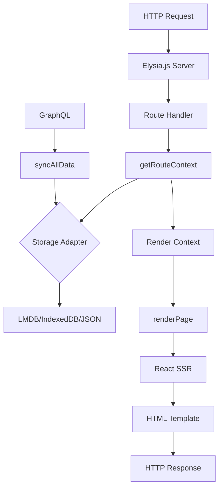

# SSR Architecture

Deep dive into SSR-Starter's Server-Side Rendering architecture and data flow.

## Core Concepts

### What is SSR?

Server-Side Rendering (SSR) generates HTML on the server for each request, providing:

- **SEO Benefits**: Search engines see fully rendered content
- **Performance**: Faster initial page loads
- **Social Sharing**: Proper meta tags and Open Graph data
- **Accessibility**: Content available without JavaScript

### SSR-Starter Architecture



## Request Flow

### 1. HTTP Request

```typescript
// server/index.ts
app.get('*', async ({ request }) => {
  const url = new URL(request.url);
  const path = url.pathname;

  // Route handling logic
});
```

### 2. Context Resolution

```typescript
// Get minimal context for route
const context = dbOperations.getRouteContext(path);

// Context contains:
// - posts (filtered by route)
// - categories, tags, authors
// - site metadata
// - assets configuration
```

### 3. React Rendering

```typescript
// server/render.tsx
export async function renderPage(path: string, context: RenderContext) {
  const html = renderToString(
    <AppRouter path={path} context={context} />
  );

  return { html, meta: getMetaForPath(path, context) };
}
```

### 4. HTML Assembly

```typescript
// server/template.ts
const html = `
<!DOCTYPE html>
<html>
<head>
  <title>${meta.title}</title>
  <!-- Meta tags, styles, scripts -->
</head>
<body>
  <div id="root">${html}</div>
  <script src="/entry-client.js"></script>
</body>
</html>
`;
```

## Storage Architecture

### Adapter Pattern

```typescript
// server/storage/types.ts
interface StorageAdapter {
  save(collections: DataCollections): Promise<void>
  load(): Promise<DataCollections | null>
  clear(): Promise<void>
}
```

### Available Adapters

#### LMDB Adapter
```typescript
// server/storage/adapter.lmdb.ts
export class LMDBAdapter implements StorageAdapter {
  private db: Database;

  async save(data: DataCollections) {
    // High-performance key-value storage
    await this.db.put('posts', data.posts);
    await this.db.put('categories', data.categories);
  }

  async load() {
    // Synchronous reads from memory-mapped files
    return {
      posts: await this.db.get('posts'),
      categories: await this.db.get('categories')
    };
  }
}
```

#### IndexedDB Adapter
```typescript
// Uses browser's IndexedDB for client-side storage
// Falls back to JSON files on server
```

#### JSON Adapter
```typescript
// server/storage/adapter.json.ts
export class JSONAdapter implements StorageAdapter {
  private filePath = './data/json/full.json';

  async save(data: DataCollections) {
    await writeFile(this.filePath, JSON.stringify(data));
  }

  async load() {
    try {
      const content = await readFile(this.filePath, 'utf8');
      return JSON.parse(content);
    } catch {
      return null;
    }
  }
}
```

## Data Synchronization

### GraphQL Integration

```typescript
// server/sync.ts
export async function syncAllData() {
  const [posts, categories, tags, authors, pages] = await Promise.all([
    getPosts(),
    getCategories(),
    getTags(),
    getAuthors(),
    getPages()
  ]);

  await storageAdapter.save({
    posts,
    categories,
    tags,
    authors,
    pages,
    site: defaultSite,
    menu: defaultMenu
  });
}
```

### Incremental Updates

```typescript
// Future: Incremental sync
export async function syncIncremental() {
  const lastSync = await getLastSyncTime();
  const updates = await fetchUpdatesSince(lastSync);

  await storageAdapter.merge(updates);
}
```

## Route-Based Optimization

### Context Slicing

```typescript
// server/sync.ts
export function getRouteContext(path: string): RenderContext {
  const baseContext = getBaseContext();

  // Optimize context based on route
  switch (normalizePath(path)) {
    case '/':
      return {
        ...baseContext,
        posts: { posts: baseContext.posts.posts.slice(0, 8) }
      };

    case '/blog':
    case '/blog/:page':
      return getBlogContext(baseContext, page);

    case '/posts/:slug':
      return getPostContext(baseContext, slug);

    default:
      return baseContext;
  }
}
```

### Blog Pagination

```typescript
function getBlogContext(baseContext: RenderContext, page: number = 1) {
  const perPage = getBlogPageSize();
  const start = (page - 1) * perPage;
  const end = start + perPage;

  return {
    ...baseContext,
    posts: { posts: baseContext.posts.posts.slice(start, end) },
    route: {
      type: 'blog',
      page,
      perPage,
      totalPosts: baseContext.posts.posts.length
    }
  };
}
```

### Single Post Context

```typescript
function getPostContext(baseContext: RenderContext, slug: string) {
  const post = baseContext.posts.posts.find(p => p.slug === slug);
  const related = findRelatedPosts(post, baseContext.posts.posts, 4);

  return {
    ...baseContext,
    posts: { posts: [post, ...related] },
    route: {
      type: 'post',
      slug,
      postId: post?.id
    }
  };
}
```

## Caching Strategy

### Multi-Level Caching

```typescript
// 1. In-memory cache (fastest)
let renderContextCache: RenderContext | null = null;

// 2. Route-specific cache
const routeContextCache = new Map<string, RenderContext>();

// 3. Storage adapter cache
// 4. HTTP cache headers
```

### Cache Invalidation

```typescript
function invalidateCaches() {
  renderContextCache = null;
  routeContextCache.clear();

  // Invalidate storage cache if needed
  storageAdapter.invalidate?.();
}
```

## Performance Optimizations

### Memory Management

```typescript
// Limit cached contexts
const MAX_ROUTE_CACHE_SIZE = 100;

if (routeContextCache.size > MAX_ROUTE_CACHE_SIZE) {
  // LRU eviction
  const firstKey = routeContextCache.keys().next().value;
  routeContextCache.delete(firstKey);
}
```

### Lazy Loading

```typescript
// Lazy load heavy components
const HeavyComponent = lazy(() => import('./HeavyComponent'));

// Code splitting for routes
const BlogPage = lazy(() => import('./routes/Blog'));
```

### Asset Optimization

```typescript
// Preload critical fonts
<link rel="preload" href="/fonts/nunito.woff2" as="font">

// Async load non-critical CSS
<link rel="stylesheet" href="/styles.css" media="print" onload="this.media='all'">
```

## Error Handling

### Graceful Degradation

```typescript
export async function getRouteContext(path: string): Promise<RenderContext> {
  try {
    // Try primary storage
    return await storageAdapter.load();
  } catch (primaryError) {
    try {
      // Fallback to backup storage
      return await backupAdapter.load();
    } catch (backupError) {
      // Final fallback to defaults
      return getDefaultContext();
    }
  }
}
```

### Error Boundaries

```typescript
// React error boundary for SSR
class SSRErrorBoundary extends Component {
  static getDerivedStateFromError(error: Error) {
    return { hasError: true, error };
  }

  render() {
    if (this.state.hasError) {
      return <ErrorFallback error={this.state.error} />;
    }
    return this.props.children;
  }
}
```

## Monitoring and Debugging

### Performance Metrics

```typescript
// Track SSR performance
const startTime = performance.now();

const { html, meta } = await renderPage(path, context);

const renderTime = performance.now() - startTime;
console.log(`SSR for ${path}: ${renderTime}ms`);
```

### Health Checks

```typescript
// server/index.ts
app.get('/health', async () => {
  const metrics = {
    status: 'healthy',
    timestamp: new Date().toISOString(),
    posts: dbOperations.getPosts().length,
    memory: process.memoryUsage(),
    uptime: process.uptime()
  };

  return metrics;
});
```

## Best Practices

### 1. Minimize Context Size
- Use route-specific context slicing
- Avoid sending unnecessary data to client

### 2. Optimize Bundle Size
- Code splitting for large components
- Tree shaking unused dependencies

### 3. Cache Strategically
- Cache static assets with long TTL
- Use ETags for dynamic content

### 4. Monitor Performance
- Track SSR render times
- Monitor memory usage
- Set up error tracking

### 5. Handle Errors Gracefully
- Provide fallback content
- Log errors for debugging
- Maintain service availability

This architecture provides a solid foundation for scalable SSR applications with excellent performance and developer experience.
