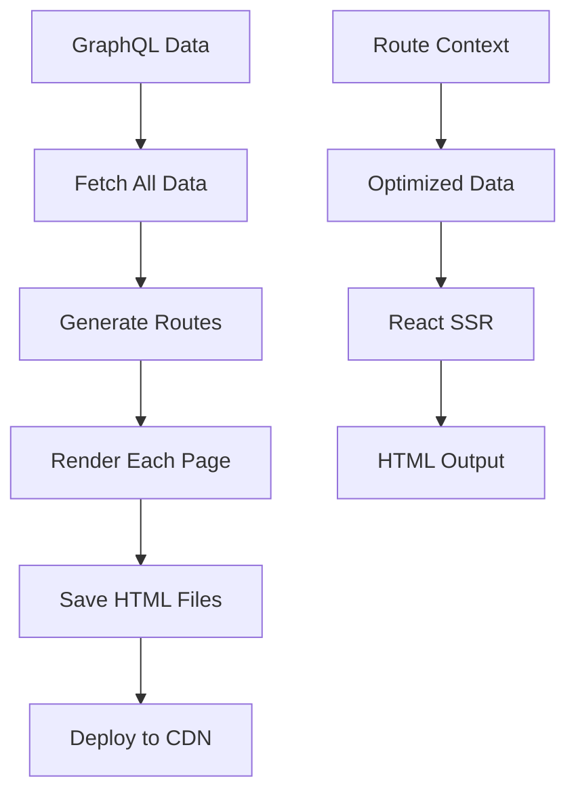

# Static Site Generation

Complete guide to generating static websites with SSR-Starter's SSG capabilities.

## Overview

Static Site Generation (SSG) pre-renders your entire website as static HTML files during build time. This approach provides:

- **Maximum Performance**: Instant page loads from CDN
- **SEO Optimization**: All content available to search engines
- **Reliability**: No server runtime dependencies
- **Scalability**: Serve millions of requests with minimal infrastructure

## How SSG Works



## Quick Start

### Generate Static Site

```bash
# 1. Configure your environment
cp env.example .env
# Set GRAPHQL_ENDPOINT and S3_ASSETS_URL

# 2. Build and generate static files
bun run build
bun run scripts/generate

# 3. Check generated files
ls -la www/html/
# index.html, blog/index.html, posts/my-post/index.html, etc.
```

### Serve Static Files

```bash
# Using a simple HTTP server
cd www/html && python3 -m http.server 8080

# Or using Bun
bunx serve www/html

# Visit http://localhost:8080
```

## Configuration

### Environment Variables

```bash
# Required
GRAPHQL_ENDPOINT=https://your-site.com/graphql
S3_ASSETS_URL=https://your-assets.com

# Optional
MAINDB=JsonDB              # Use JSON for static generation
BLOG_PAGE_SIZE=12          # Posts per blog page
```

### Generator Configuration

```typescript
// scripts/routeToStatic.ts
const config = {
  outputDir: './www/html',
  syncBefore: true,        // Fetch fresh data before generation
  blogPageSize: 12,        // Posts per page
  cleanOutput: true        // Remove old files
};
```

## Route Generation

### Automatic Route Discovery

SSR-Starter automatically discovers routes from your data:

```typescript
// scripts/routeToStatic.ts
private collectRoutes(context: RenderContext): string[] {
  const routes = new Set<string>([
    '/',           // Homepage
    '/about',      // Static pages
    '/blog',       // Blog listing
    '/search',     // Search page
    '/categories', // Category listing
    '/tags',       // Tag listing
    '/authors'     // Author listing
  ]);

  // Add post routes
  context.posts.posts.forEach(post => {
    routes.add(`/posts/${post.slug}`);
  });

  // Add category routes
  context.categories.forEach(category => {
    routes.add(`/category/${category.slug}`);
  });

  // Add pagination routes
  const perPage = this.config.blogPageSize ?? 3;
  const totalPages = Math.ceil(context.posts.posts.length / perPage);
  for (let page = 2; page <= totalPages; page++) {
    routes.add(`/blog/${page}`);
  }

  return Array.from(routes).sort();
}
```

### Custom Route Addition

```typescript
// Add custom routes
routes.add('/custom-page');
routes.add('/api-docs');

// Add dynamic routes
userProfiles.forEach(user => {
  routes.add(`/profile/${user.slug}`);
});
```

## Data Optimization

### Route-Specific Context

Each route gets optimized data context:

```typescript
// Homepage - Latest posts only
const homeContext = {
  ...baseContext,
  posts: { posts: allPosts.slice(0, 8) },
  route: { type: 'home', perPage: 8 }
};

// Blog page - Paginated posts
const blogContext = {
  ...baseContext,
  posts: { posts: allPosts.slice(start, end) },
  route: { type: 'blog', page, perPage }
};

// Single post - Post + related
const postContext = {
  ...baseContext,
  posts: { posts: [post, ...relatedPosts] },
  route: { type: 'post', slug: post.slug }
};
```

### Data Embedding

Static pages can embed data directly in HTML:

```html
<!DOCTYPE html>
<html>
<head>
  <script>
    window.__RENDER_CONTEXT__ = {
      "posts": { "posts": [...] },
      "categories": [...],
      // ... full context
    };
  </script>
</head>
<body>
  <div id="root"><!-- SSR content --></div>
</body>
</html>
```

## Build Process

### Complete Build Pipeline

```bash
# 1. Install dependencies
bun install

# 2. Sync data from GraphQL
bun run build  # Runs data sync + asset compilation

# 3. Generate static HTML
bun run scripts/generate

# 4. Verify output
ls -la www/html/
tree www/html/
```

### Incremental Builds

```typescript
// scripts/incremental-generate.ts
export async function generateIncremental(changedSlugs: string[]) {
  const context = await getBaseContext();

  // Only regenerate changed routes
  const routes = changedSlugs.map(slug => `/posts/${slug}`);

  for (const route of routes) {
    await renderAndWriteRoute(route, context, outputDir);
  }
}
```

## File Structure

### Generated Output

```
www/html/
├── index.html                    # Homepage
├── blog/
│   ├── index.html               # Blog page 1
│   └── 2/
│       └── index.html           # Blog page 2
├── posts/
│   └── my-awesome-post/
│       └── index.html           # Individual post
├── category/
│   └── technology/
│       └── index.html           # Category page
├── assets/                      # Static assets
│   ├── fonts/
│   └── images/
└── styles.css                   # Compiled CSS
```

### URL Structure

Static sites use directory-based URLs:

```
https://example.com/           → www/html/index.html
https://example.com/blog       → www/html/blog/index.html
https://example.com/blog/2     → www/html/blog/2/index.html
https://example.com/posts/my-post → www/html/posts/my-post/index.html
```

## Deployment Options

### Netlify

```yaml
# netlify.toml
[build]
  command = "bun run build && bun run scripts/generate"
  publish = "www/html"

[build.environment]
  GRAPHQL_ENDPOINT = "https://your-site.com/graphql"
  S3_ASSETS_URL = "https://assets.netlify.com"
```

### Vercel

```json
// vercel.json
{
  "buildCommand": "bun run build && bun run scripts/generate",
  "outputDirectory": "www/html",
  "env": {
    "GRAPHQL_ENDPOINT": "https://your-site.com/graphql",
    "S3_ASSETS_URL": "https://assets.vercel.com"
  }
}
```

### GitHub Pages

```yaml
# .github/workflows/deploy.yml
name: Deploy to GitHub Pages

on:
  push:
    branches: [main]

jobs:
  build-and-deploy:
    runs-on: ubuntu-latest

    steps:
      - name: Checkout
        uses: actions/checkout@v3

      - name: Setup Bun
        uses: oven-sh/setup-bun@v1

      - name: Install dependencies
        run: bun install

      - name: Build
        run: bun run build
        env:
          GRAPHQL_ENDPOINT: ${{ secrets.GRAPHQL_ENDPOINT }}
          S3_ASSETS_URL: https://your-github-pages.com

      - name: Generate static site
        run: bun run scripts/generate

      - name: Deploy to GitHub Pages
        uses: peaceiris/actions-gh-pages@v3
        with:
          github_token: ${{ secrets.GITHUB_TOKEN }}
          publish_dir: ./www/html
```

### AWS S3 + CloudFront

```bash
# Upload to S3
aws s3 sync www/html/ s3://your-bucket --delete

# Invalidate CloudFront cache
aws cloudfront create-invalidation \
  --distribution-id YOUR_DISTRIBUTION_ID \
  --paths "/*"
```

## Performance Optimization

### Asset Optimization

```typescript
// scripts/routeToStatic.ts - Asset copying
private copyStaticAssets(cfg: RouteToStaticConfig) {
  // Copy with compression
  this.copyFileIfExists(
    cfg.stylesPath!,
    join(cfg.outputDir, 'styles.css')
  );

  // Copy minified JS
  this.copyFileIfExists(
    cfg.entryClientPath!,
    join(cfg.outputDir, 'entry-client.js')
  );
}
```

### HTML Minification

```typescript
// Minify HTML output
const minifiedHtml = html
  .replace(/\n+/g, ' ')
  .replace(/\s+/g, ' ')
  .replace(/\s*>\s*</g, '><')
  .trim();
```

### Image Optimization

```typescript
// Generate responsive images
const imageSizes = [320, 640, 1024, 1920];
for (const size of imageSizes) {
  await generateImageVariant(originalImage, size);
}
```

## SEO and Meta Tags

### Automatic Meta Generation

```typescript
// server/render.tsx
function getMetaForPath(path: string, context: RenderContext) {
  const normalized = normalizePath(path);

  if (normalized === '/') {
    return {
      title: context.site.title,
      description: context.site.description,
      canonical: `${context.site.url}/`,
      ogTitle: context.site.title,
      ogDescription: context.site.description
    };
  }

  if (normalized.startsWith('/posts/')) {
    const slug = normalized.replace('/posts/', '');
    const post = context.posts.posts.find(p => p.slug === slug);
    return {
      title: post?.title,
      description: post?.excerpt,
      canonical: `${context.site.url}${normalized}`,
      ogImage: post?.featuredImage?.url
    };
  }

  // ... other route types
}
```

### Structured Data

```typescript
// Add JSON-LD structured data
const structuredData = {
  "@context": "https://schema.org",
  "@type": "Article",
  "headline": post.title,
  "description": post.excerpt,
  "image": post.featuredImage?.url,
  "datePublished": post.date.raw,
  "author": {
    "@type": "Person",
    "name": post.author?.name
  }
};
```

## Advanced Features

### Incremental Regeneration

```typescript
// Regenerate only changed content
export async function regenerateContent(changedSlugs: string[]) {
  const context = await getBaseContext();

  for (const slug of changedSlugs) {
    // Regenerate post page
    await renderAndWriteRoute(`/posts/${slug}`, context, outputDir);

    // Regenerate related pages
    await renderAndWriteRoute('/blog', context, outputDir);
    await renderAndWriteRoute('/', context, outputDir);
  }
}
```

### Preview Mode

```typescript
// Generate preview for unpublished content
export async function generatePreview(draftContent: PostData) {
  const context = await getBaseContext();

  // Add draft to context
  context.posts.posts.unshift(draftContent);

  // Generate preview page
  await renderAndWriteRoute(
    `/preview/${draftContent.slug}`,
    context,
    outputDir
  );
}
```

### Multi-language Support

```typescript
// Generate for multiple locales
const locales = ['en', 'es', 'fr'];

for (const locale of locales) {
  const localizedContext = await getLocalizedContext(locale);
  const localeOutputDir = join(outputDir, locale);

  await generateAllRoutes(localizedContext, localeOutputDir);
}
```

## Monitoring and Analytics

### Build Metrics

```typescript
// Track generation performance
const buildMetrics = {
  startTime: Date.now(),
  routesGenerated: 0,
  totalSize: 0,
  errors: []
};

// After generation
buildMetrics.endTime = Date.now();
buildMetrics.duration = buildMetrics.endTime - buildMetrics.startTime;

console.log('Build completed:', buildMetrics);
```

### Content Analytics

```typescript
// Analyze generated content
const analytics = {
  totalPages: routes.length,
  totalPosts: context.posts.posts.length,
  averagePageSize: totalSize / routes.length,
  largestPages: routesWithSizes.slice(-10),
  seoScore: calculateSeoScore(routes)
};
```

## Troubleshooting

### Common SSG Issues

**"No routes generated"**:
```bash
# Check data availability
curl http://localhost:3000/health

# Verify GraphQL connection
curl $GRAPHQL_ENDPOINT -X POST \
  -d '{"query": "{ posts { nodes { id } } }"}'
```

**"Missing assets"**:
```bash
# Check asset paths
ls -la dist/

# Verify S3_ASSETS_URL
curl $S3_ASSETS_URL/fonts/nunito.woff2
```

**"Large bundle size"**:
```bash
# Analyze bundle
bunx npx webpack-bundle-analyzer dist/entry-client.js

# Enable code splitting
// In build config
const config = {
  codeSplitting: true,
  chunkSize: 100 * 1024 // 100KB
};
```

**"SEO issues"**:
```bash
# Test meta tags
curl -s http://localhost:3000 | grep -i "meta\|title"

# Check structured data
curl -s http://localhost:3000/posts/my-post | \
  grep -A 20 "application/ld+json"
```

### Performance Issues

**"Slow generation"**:
```bash
# Profile generation
time bun run scripts/generate

# Optimize data fetching
// Use parallel requests
await Promise.all([
  fetchPosts(),
  fetchCategories(),
  fetchTags()
]);
```

**"Memory issues"**:
```bash
# Monitor memory usage
bun run scripts/generate &
watch -n 1 'ps aux | grep bun'
```

## Best Practices

### Content Strategy

1. **Optimize content structure**:
   - Use consistent URL patterns
   - Implement proper redirects
   - Plan content hierarchy

2. **SEO optimization**:
   - Add proper meta descriptions
   - Include structured data
   - Optimize images and performance

3. **Performance considerations**:
   - Minimize bundle size
   - Use lazy loading for images
   - Implement proper caching headers

### Deployment Strategy

1. **Use CDNs**:
   - Deploy to multiple regions
   - Implement proper caching
   - Use image optimization

2. **Monitor performance**:
   - Track Core Web Vitals
   - Monitor error rates
   - Set up alerting

3. **Plan for updates**:
   - Implement incremental builds
   - Use preview deployments
   - Automate the process

This comprehensive SSG system provides the foundation for high-performance, SEO-friendly static websites with the flexibility of dynamic data sources.
